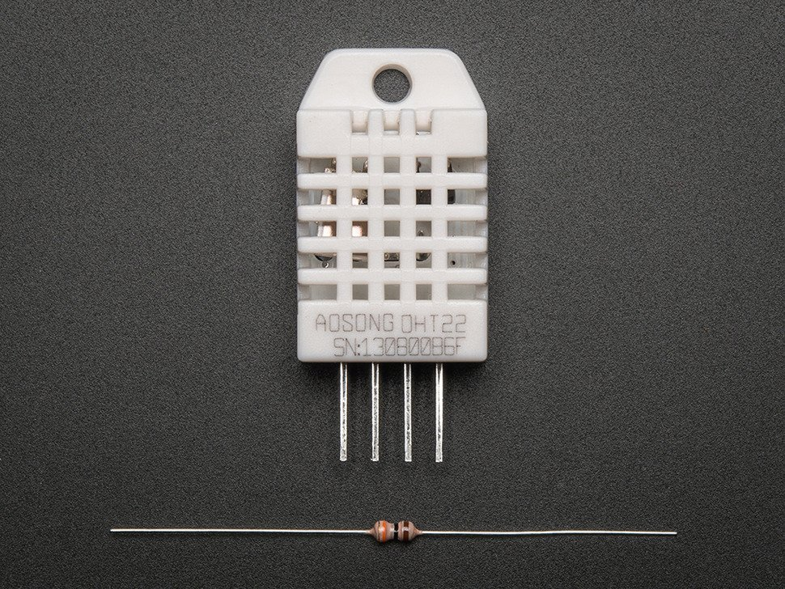
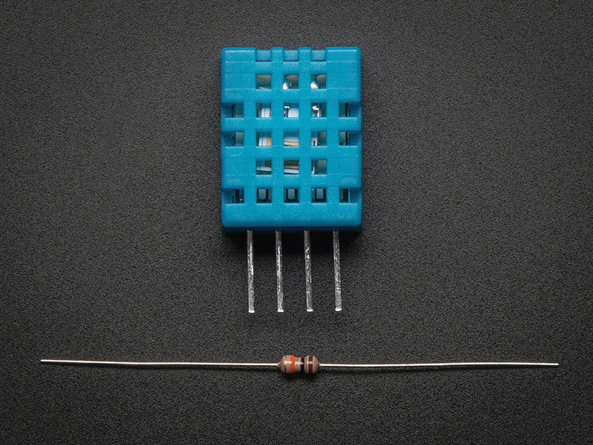
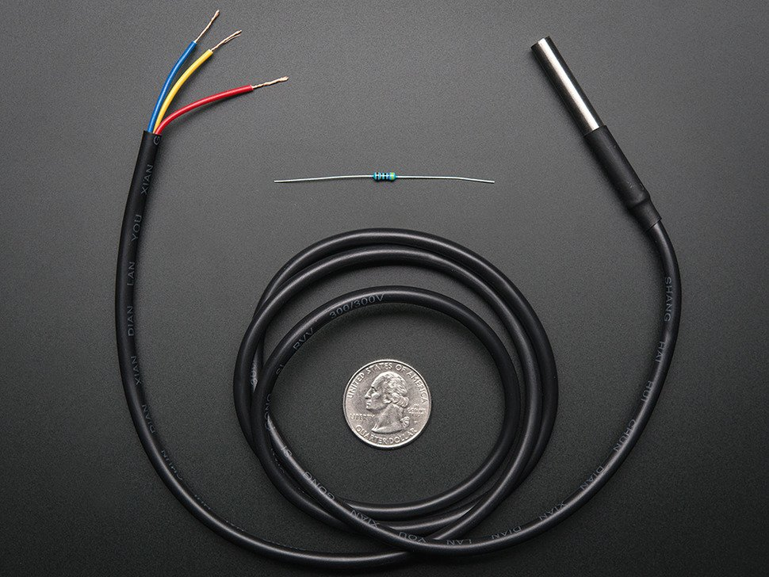
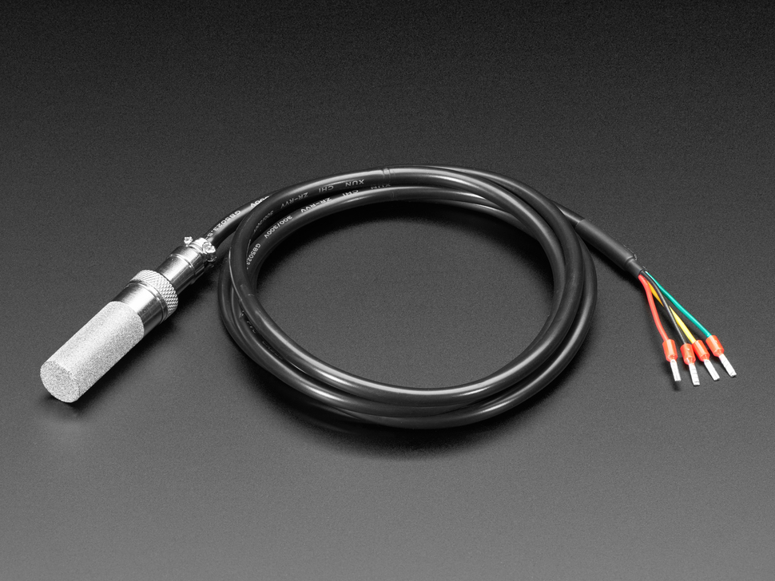
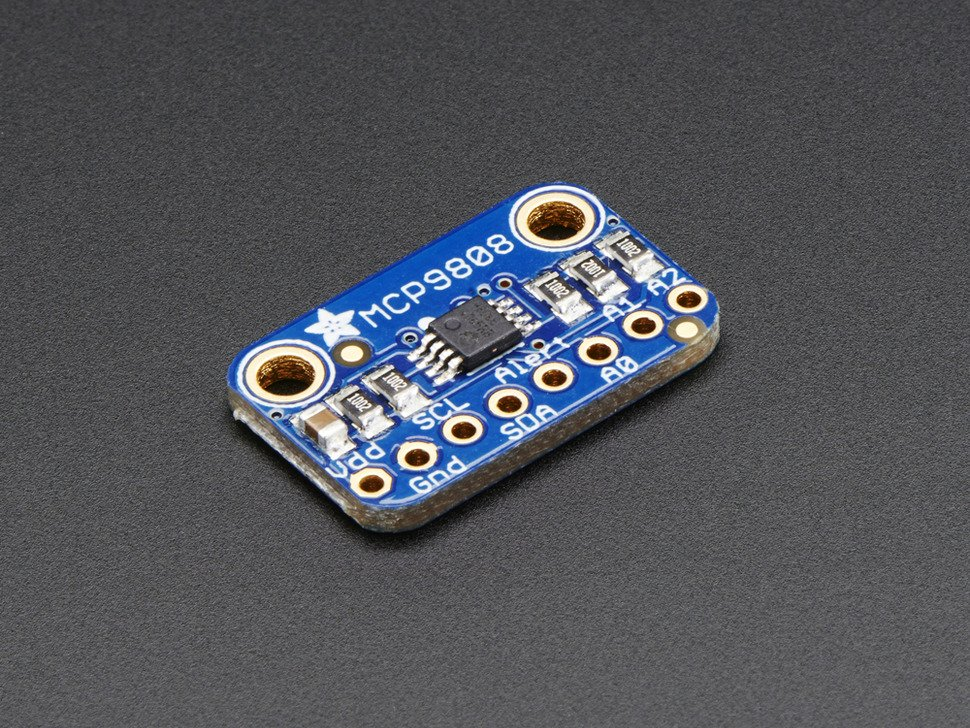
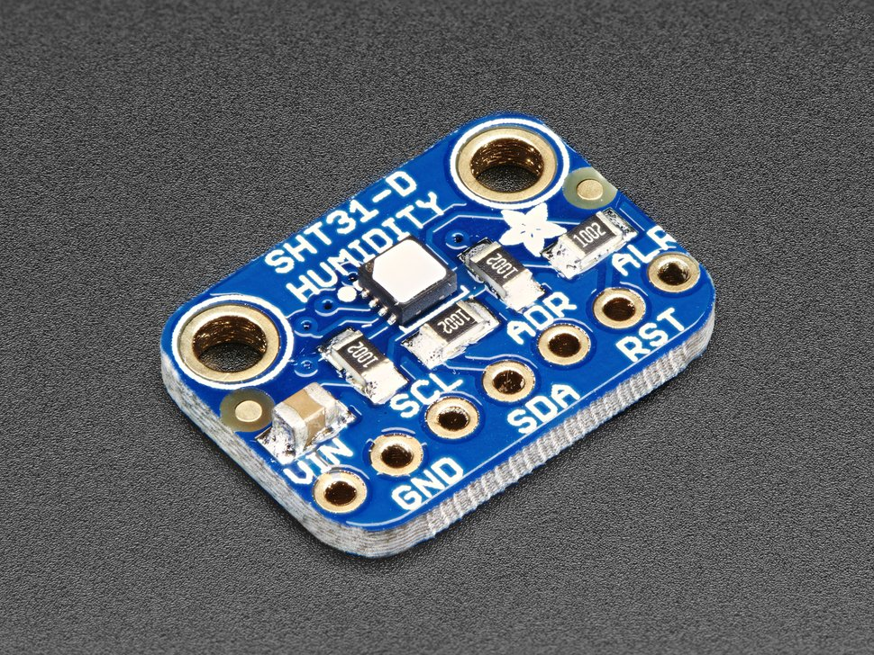
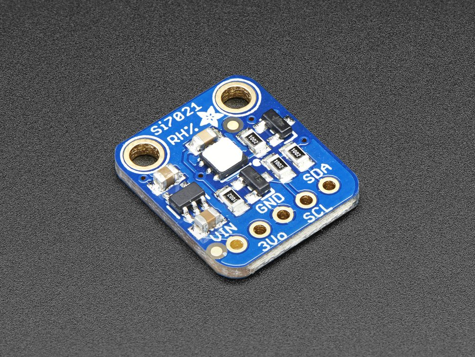
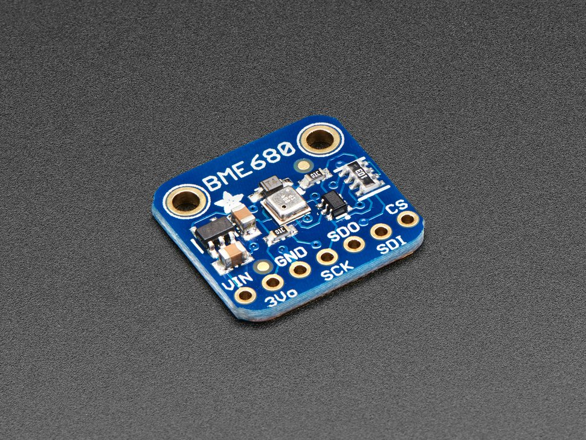
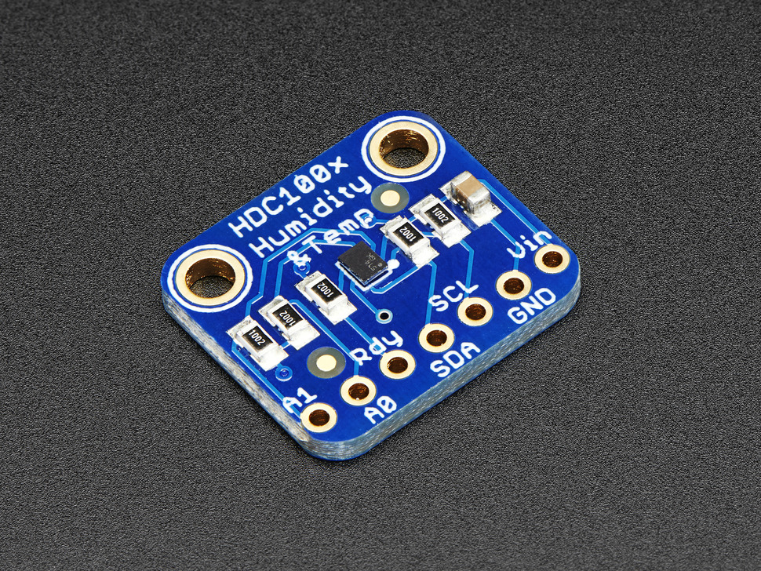

# Optionen für Temperatur/Feuchte Sensoren

|          Bild           | Sensor  |       Genauigkeit       |      Messbereich       | Sampling Rate | Preis  |             Kommentar              |
| :---------------------: | :-----: | :---------------------: | :--------------------: | :-----------: | :----: | :--------------------------------: |
|      | DHT 22  |    ± 0.5 K & ± 2-5 %    | -40 - 80 °C & 0-100 %  |     2 sec     | $9.95  |
|      | DHT 11  |      ± 2 K & ± 5 %      |  0 - 50 °C & 20-80 %   |     1 sec     | $5.00  |
|  | DS18B20 |         ± 0.5 K         |      -55 - 125 °C      |    750 ms     | $9.95  |
|    | SHT-10  | ± 0.5 K & ± 1.8 - 4.5 % | -40 - 120 °C & 0-100 % |       -       | $49.95 |
|    | SHT-30  |     ± 0.5 K & ± 2 %     |           -            |       -       | $24.95 |
|  | MCP9808 |        ± 0.25 K         |      -40 - 125 °C      |       -       | $4.95  | Gute Preis-Leistung, keine Feuchte |
|  | SHT31-D |     ± 0.3 K & ± 2 %     | -40 - 125 °C & 0-100 % |       -       | §13.95 |
|    | Si7021  |     ± 0.4 K & ± 3 %     |  -10 - 85 °C & 0-80 %  |       -       | $8.95  |  Gute Preis-Leistung, mit Feuchte  |
|    | BME680  |      ± 1 K & ± 3 %      |           -            |       -       | $22.50 |   Zusätzlich: Luftdruck, VOC Gas   |
|  | HDC1008 |     ± 0.2 K & ± 4 %     | -20 - 85 °C & 10-80 %  |       -       | $7.95  |
