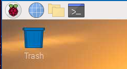
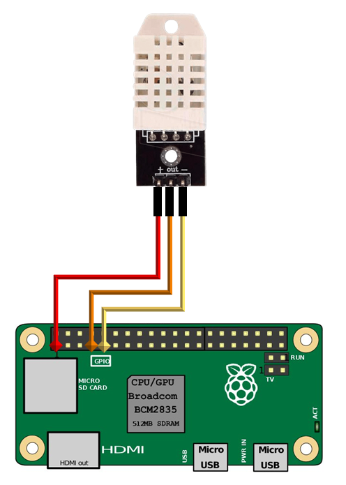
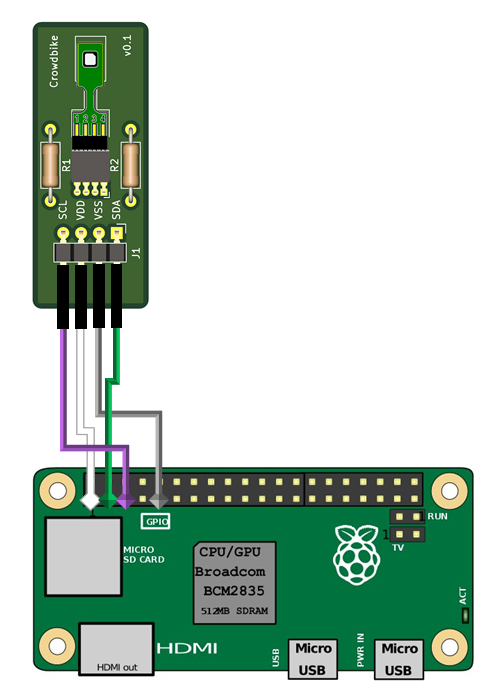
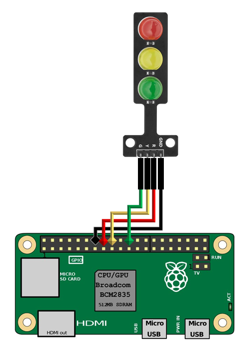
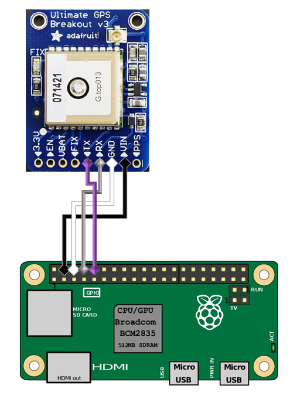
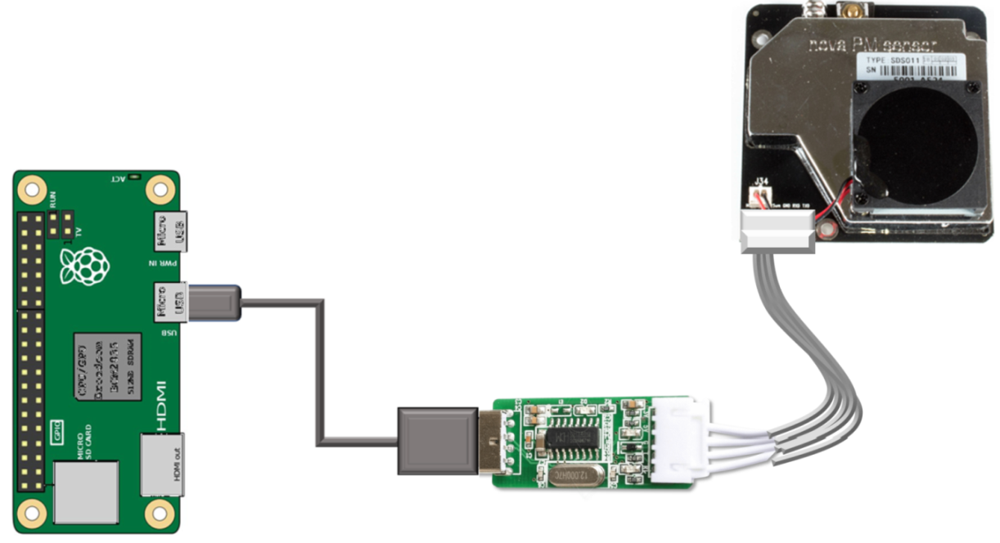
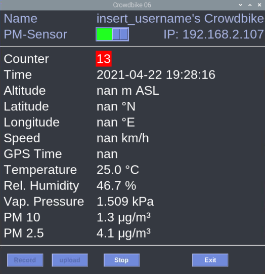

[](https://results.pre-commit.ci/latest/github/theendlessriver13/crowdbike/master)

# Crowdbike - Mobile Erfassung von Klimadaten mit Low-Cost-Sensoren

### This is a fork: First established at University of Freiburg, Enviromental Meteorology by [Andreas Christen](https://github.com/achristen)

- The original documentation and code can be found [here](https://github.com/achristen/crowdbike)

## Benötigtes Material

1. Raspberry Pi Zero W
1. Temperatur- und Feuchte-Sensor (Adafruit DHT22 oder besser Sensirion SHT85)
1. GPS Modul - Adafruit Ultimate Breakout
1. Nova PM-Sensor (optional)
1. UART zu USB Adapter (5V) zum Anschluss des PM-Sensors (optional)
1. Adapter Micro-USB zu USB zum Anschluss des PM-Sensors (optional)
1. Kabel (bunte Steckbrücken) zum Anschluss aller Sensoren
1. Powerbank zur Stromversorgung des Raspberry Pi's
1. Gehäuse und Tasche zur Montage am Fahrrad
1. Ansaugschlauch für PM-Sensor (optional)
1. Adapterplatine (nur bei SHT 85)

## Benötigte Software/Hardware zur Einrichtung

1. Laptop/Computer mit VNC Viewer (Download [hier](https://www.realvnc.com/de/connect/download/viewer/))
1. Raspberry Pi Imager um das Operating System zu installieren. Download hier für:
   - [Windows](https://downloads.raspberrypi.org/imager/imager.exe)
   - [macOS](https://downloads.raspberrypi.org/imager/imager.dmg)
   - [Ubuntu](https://downloads.raspberrypi.org/imager/imager_amd64.deb)
1. WLAN-Netzwerk mit Zugang zum Internet
1. Smartphone mit VNC-Viewer (Download über Smartphone [Android](https://play.google.com/store/apps/details?id=com.realvnc.viewer.android&hl=de) oder [iOS](https://apps.apple.com/de/app/vnc-viewer-remote-desktop/id352019548))

## Einrichtung des Raspberry Pi - Erstmalige Verwendung

### Systemsetup

1. Operating System Image herunterladen und entpacken (Link siehe moodle)
1. Die MicroSD-Karte (ggf. mit Adapter) in den Computer einlegen.
1. Raspberry Pi Imager starten
1. Bei `CHOOSE OS` &rarr; `Use custom` das eben heruntergeladene Image auswählen.
1. Bei `CHOOSE SD CARD` die eingeschobene SD-Karte wählen. **Hinweis: genau kontrollieren dass das richtige Laufwerk ausgewählt ist. Es wird im Verlauf formatiert und alle Daten werden überschrieben!**
1. Mit `WRITE` den Schreibvorgang starten.
1. Wenn der Schreib- und Verify-Vorgang nach einiger Zeit abgeschlossen ist, SD-Karte kurz entnehmen und wieder einstecken. Dann das Laufwerk `boot` im Explorer öffnen.
1. Hier die Datei `config.txt` öffnen und folgende Einträge so verändern wie hier dargestellt. Dies ändert die Bildschirmauflösung, sodass sie hochkant und für den Smartphone-Bildschirm passend ist.
   ```bash
   # uncomment to force a console size. By default it will be display's size minus
   # overscan.
   framebuffer_width=720
   framebuffer_height=1280
   ```
1. Die Datei speichern und schließen.

#### WLAN Konfiguration

1. Eine neue Datei mit dem exakten Namen `wpa_supplicant.conf` anlegen
   1. Rechtsklick &rarr; Neu &rarr; Textdokument &rarr; `wpa_supplicant.conf` als Dateinamen eingeben (darauf achten, dass kein `.txt` mehr am Ende steht!))
   1. Eventuell müssen in Windows erst die Dateinamenerweiterungen aktiviert werden. Dies geschieht über Ansicht und dann einen Haken bei Dateinamenerweiterungen setzen.
1. Bei der Frage "Wollen Sie die Dateinamenerweiterung ändern, wird die Datei möglicherweise unbrauchbar" mit `Ja` bestätigen.
1. Nun mit Rechtsklick &rarr; Öffnen mit den Editor auswählen
1. Es müssen nun Folgende Einträge eingefügt werden:
   ```bash
   ctrl_interface=DIR=/var/run/wpa_supplicant GROUP=netdev
   update_config=1
   country=DE
   network={
       ssid="Name eures Heim-WLANs"
       priority=1
       psk="Passwort eures Heim-WLANs"
   }
   network={
       ssid="Name eures Smartphone-Hotspots"
       priority=2
       psk="Passwort eures Smartphone-Hotspots"
   }
   ```
1. Darauf achten, dass Name und Passwort in `""` stehen!
1. Es dürfen keine Leerzeichen das `=` umgeben!
1. 3x kontrollieren dass das Passwort und die SSID stimmt!!
1. Die Datei speichern und schließen.

### Starten des Raspberry Pi

1. Anschließen der Powerbank an den Raspberry Pi an den Eingang `PWR IN`
1. Raspberry pi sollte nun booten (grüne LED blinkt)
1. Ca. 2-3 Minuten warten

## Herstellen einer Verbindung vom Laptop/Computer

1. Verbinden des Laptops/Computers mit dem gleichem WLAN-Netzwerk wie der Raspberry Pi &rarr; Heim-WLAN wie zuvor eingestellt.
1. Starten von VNC Viewer am Laptop/Computer
1. Datei &rarr; Neue Verbindung
1. VNC Server: `crowdbike` (oder lokale IP-Adresse wenn bekannt)
1. Name: &rarr; Name der Verbindung z.B. `Mein Crowdbike` &rarr; `OK`
1. Doppelklick auf neue Verbindung und bei Frage nach Identität bestätigen
1. Verbindung sollte nun hergestellt werden
1. Benutzername `pi` und Kennwort `Bike4Climate` eingeben, ggf. Haken bei Kennwort speichern setzen &rarr; `OK`

## Installieren der Software

### Kurztipp: Navigation im Linux-Terminal

- Automatisches Ergänzen des Ausdrucks oder Pfads im Terminal immer mit der <kbd>TAB-Taste</kbd>
- Bestätigen von Befehlen immer mit <kbd>Enter</kbd>. Wenn erfolgreich, keine Rückgabe, ansonsten erscheint eine Error-Mitteilung anhand derer festgestellt werden kann, was nicht funktioniert hat.
- Verzeichnis/Ordner wechseln `cd <Ordnername>` (im Stammverzeichnis `'/'` mit `cd /<Ordnername>`)
- Ordnerinhalt anzeigen `ls` oder `ls -l` (-l für Liste)
- Order in aktuellem Verzeichnis erstellen `mkdir <Ordnername>`
- In übergeordnetes Verzeichnis wechseln `cd ..`
- Letzte eingegebene Befehle wieder aufrufen mit &uarr; und &darr; (Pfeiltasten rauf/runter)
- Einfügen von sich im Zwischenspeicher befindlichen Text mit `Rechtsklick`

### Einrichtung des Betriebssystems abschließen

- Terminal öffnen (obere Leiste, schwarzes Symbol):



- Falls die Schrift sehr klein ist, kann diese im Terminal mit <kbd>ctrl</kbd>+<kbd>+</kbd> vergrößert werden

- Hostnamen setzen

  1. Eingabe von `sudo raspi-config`
  1. mit Pfeiltasten zu "1 System Options" navigieren und mit `Enter` bestätigen
  1. Zu "S4 Hostname" navigieren &rarr; <kbd>Enter</kbd> &rarr; Hinweis mit `<Ok>` bestätigen
  1. Nun den Namen zu `crowdbike13` (Die euch zugewiesene Nummer) ändern
  1. Mit `<Ok>` bestätigen (Hinweis: Pfeiltasten &larr;/&rarr; oder <kbd>TAB</kbd> nutzen um zu `<Ok>` zu springen)

- Serielle Schnittstelle und I2C aktivieren

  1. mit Pfeiltasten zu "3 Interface Options" navigieren und mit <kbd>Enter</kbd> bestätigen
  1. Zu "P5 I2C" navigieren &rarr; <kbd>Enter</kbd>
     "Would you like the ARM I2C interface to be enabled?" hier `<YES>` auswählen
     "ARM I2C interface is enabled" mit `<OK>` bestätigen
  1. erneut mit Pfeiltasten zu "3 Interface Options" navigieren und mit <kbd>Enter</kbd> bestätigen
  1. Zu "P6 Serial" navigieren &rarr; <kbd>Enter</kbd>
     "Would you like to a login shell to be accessible over serial?" hier `<No>` auswählen
  1. "Would you like the serial port hardware to be enabled?" hier `<Yes>` auswählen
  1. "The serial login shell is disabled"
  1. "The serial interface is enabled"
  1. Mit `<Ok>` bestätigen
  1. Mit `<Finish>` beenden (Hinweis: Pfeiltasten &larr;/&rarr; oder <kbd>TAB</kbd> nutzen um zu `<Finish>` zu springen)
  1. "Would you like to reboot now?" mit `<yes>` bestätigen
  1. Ca. 1-2 Minuten warten

- Nun muss die Verbindung mit den neu vergebenen Hostnamen hergestellt werden wie in (Herstellen einer Verbindung vom Laptop/Computer) beschrieben.
- Nun nutzt ihr jedoch nicht mehr den Hostnamen `crowdbike`, sondern den neu vergebenen z.B. `crowdbike13`.
- Im VNC Viewer &rarr; `Rechtsklick` auf die zuvor erstellte Verbindung &rarr; `Eigenschaften` &rarr; bei `VNC Server` `crowdbike` zu `crowdbike13` ändern &rarr; `OK`
- Verbindung mit Doppelklick wieder herstellen und Warnung zur Identitätsbestätigung mit `Forsetzen` bestätigen &rarr; ggf. Kennwort erneut eingeben und Haken bei Kennwort speichern setzen.

### Für die Sensoren benötigte Programme herunterladen und installieren

- wieder den Terminal öffnen und ggf. mit <kbd>ctrl</kbd>+<kbd>+</kbd> wieder die Schriftgröße erhöhen
- `sudo pip3 install https://github.com/theendlessriver13/crowdbike/releases/download/0.8.0/crowdbike-0.8.0-py2.py3-none-any.whl`
- Das dauert einige Minuten, der Raspberry Pi Zero ist nicht sehr schnell.
- Nun den Raspberry Pi erneut ausschalten, um die Sensoren anzuschließen.
  - `sudo shutdown -P now`
  - Warten bis grüne LED nicht mehr leuchtet, dann Stromversorgung (Powerbank) trennen

## Anschluss der Sensoren

### Temperatur- und Feuchte-Sensor DHT-22

1. Kabel wie folgt verbinden

| Sensor |       Pi       | Kabelfarbe |
| :----: | :------------: | :--------: |
|   +    | PIN 1 (3,3 V+) |    rot     |
|   -    |  PIN 9 (GND)   |  schwarz   |
|  out   | PIN 7 (GPCLK0) |    gelb    |



### Temperatur- und Feuchte-Sensor SHT-85

1. Kabel wie folgt verbinden

| Sensor |       Pi        | Kabelfarbe |
| :----: | :-------------: | :--------: |
|  SCL   | PIN 3 (SCL1I2C) |  violett   |
|  VDD   | PIN 1 (3,3 V+)  |    weiß    |
|  VSS   | PIN 9 (Ground)  |    grau    |
|  SDA   | PIN 2 (SDA1I2C) |    grün    |



### Status Ampel

1. Kabel wie folgt verbinden

| Ampel |       Pi        | Kabelfarbe |
| :---: | :-------------: | :--------: |
|   G   | PIN 22 (GPIO25) |    grün    |
|   Y   | PIN 18 (GPIO24) |    gelb    |
|   R   | PIN 16 (GPIO23) |    rot     |
|  GRN  | PIN 14 (Ground) |  schwarz   |



### GPS

1. Kabel wie folgt verbinden

| GPS |      Pi      | Kabelfarbe |
| :-: | :----------: | :--------: |
| VIN | PIN 4 (5V+)  |  schwarz   |
| GND | PIN 6 (GND)  |    weiß    |
| TX  | PIN 10 (RXD) |  violett   |
| RX  | PIN 8 (TXD)  |    grau    |



### PM-Sensor (optional)

1. Micro-USB auf USB Adapter an den Micro-USB-Port `USB` anschließen
1. An die USB-A-Buchse den UART-USB-Adapter anschließen
1. Weißes Kabel vom PM-Sensor zum UART-Adapter einstecken
   

## Sensoren in Betrieb nehmen

- Raspberry Pi wieder mit der Powerbank verbinden und warten bis dieser gebootet hat
- Wieder Verbindung über VNC Viewer herstellen (siehe oben)

- **Hinweis:**
- Um Werte zu erhalten, muss das GPS Empfang haben. Dies ist erkennbar, wenn die mit `FIX` gekennzeichnete LED auf dem GPS-Modul nur noch ca. alle 10-15 Sekunden blinkt. Blinkt sie in kürzeren Intervallen, ist noch kein Empfang vorhanden.

## Konfigurieren/Personalisieren der Logger-Software

Es müssen im Folgenden noch einige kleinere Anpassungen vorgenommen werden, um die Software zu personalisieren und einzurichten

- Verbindung wieder über VNC herstellen und erneut den Terminal öffnen
- Software initialisieren durch Eingabe von `crowdbike init`

- Öffnen des Files durch Eingabe von `nano ~/.config/crowdbike/config.json` und Bestätigen durch <kbd>Enter</kbd>
- im Texteditor kann nur mit dem Pfeiltastnavigiert werden, nicht mit der Maus

```json
{
  "user": {
    "studentname": "insert_username",
    "bike_nr": "01",
    "logfile_path": "/home/pi/crowdbike/logs/",
    "pm_sensor": false,
    "sampling_rate": 5,
    "sensor_id": "1"
  },
  "cloud": {
    "folder_token": "abcde1234",
    "passwd": "my_password",
    "base_url": "https://example.nextcloud.de/"
  }
}
```

- Bei `studentname = `euren Namen eingeben. Ohne Leerzeichen und Umlaute. Der Name muss in doppelten Anführungszeichen stehen z.B. `"vorname_nachname"`. Komma am Ende beachten!
- Anpassung bei `bike_nr =` eure Nummer zuweisen (Aufkleber auf SD-Karten-Slot)
- Bei `pm_sensor` angeben ob ihr einen angeschlossen habt oder nicht (es ist nur `true` oder `false` erlaubt!)
- Die `sampling_rate` steuert die Häufigkeit in der eine Messung durchgeführt wird in Sekunden.
- Die `sensor_id` ist eine eindeutige Identifikation des Temperatur- und Feuchte Sensors (Aufkleber auf der Platine)
- Bei `folder_token` den in der PPP mitgeteilten Token eintragen.
- Ebenfalls bei `passwd` und `base_url` die in der PPP mitgeteilten Daten eintragen.
- speichern mit <kbd>ctrl</kbd>+<kbd>s</kbd> und schließen mit <kbd>ctrl</kbd>+<kbd>x</kbd>

## Sensor-Kalibrierung

- Die Kalibrierung der Sensoren muss im File `~/.config/crowdbike/calibration.json` eingetragen werden.
- Öffnen des Files mit `nano ~/.config/crowdbike/calibration.json`
- Darauf achten, dass die Faktoren für die entsprechende Sensornummer eingetragen werden.
  ```json
  {
    "temp_cal_a1": 1.0,
    "temp_cal_a0": 0.0,
    "hum_cal_a1": 1.0,
    "hum_cal_a0": 0.0
  }
  ```
- speichern mit <kbd>ctrl</kbd>+<kbd>s</kbd> und schließen mit <kbd>ctrl</kbd>+<kbd>x</kbd>

## Farbgebung der GUI anpassen (optional)

- die Farbgebung der GUI kann in `~/.config/crowdbike/them.json` angepasst werden
- diese Keys müssen vorhanden sein
- Farben könnne hexadezimale Werte sein oder `red`, `green` etc.
- `b_*` = button
- `bg_*` = background
- `fg_*` = foreground
- `f_*` = font

```json
{
  "font_size": 24,
  "f_family": "Helvetica",
  "bg_col": "#36393f",
  "fg_col": "#ffffff",
  "fg_header": "#AAB8E8",
  "b_col": "#7289da",
  "b_disabled": "#5B6DAE",
  "b_hover": "#546cb2",
  "b_hl_border": "#AAB8E8"
}
```

## Erstes Starten der Logger-Software

1. Ausführen durch Eingabe von `crowdbike run` (Das Starten dauert einen Moment). Es sollte sich nun ein Fenster mit einer grafischen Benutzeroberfläche geöffnet haben.
   

### Hinweise:

- Sollten aktuell keine Werte vorhanden sein, werden sie als `nan` angezeigt und der **'Counter'** ist rot hinterlegt.
  - Dies kann der Fall sein:
    - Wenn das GPS (noch) keinen Empfang hat,
    - Wenn der PM-Sensor nicht angeschlossen oder richtig verbunden ist
  - Ist alles in Ordnung ist dieser grün hinterlegt.
- Sobald das Programm gestartet wurde, werden Daten aufgezeichnet
- Die Momentanwerte werden angezeigt und aktualisieren sich automatisch
- Der Switch **'PM-Sensor'** schaltet die Abfrage des Feinstaubsensors ein bzw. aus und versetzt ihn, falls angeschlossen in einen Schlafmodus.
  - Ist kein PM-Sensor angeschlossen, sollte der Schalter ausgeschaltet (rot) sein.
- Die Aufzeichnung der Daten kann durch drücken des **'Stop'** Buttons beendet werden
- Eine neue Aufzeichnung kann mit **Record** gestartet werden
- Das Programm verlassen und die Aufzeichnung beenden kann man über den **'Exit'** Button.

#### Status Ampel

- Die LEDs der Status Ampel sind mit den Threads der Sensoren verbunden, für jeden erfassten Messwert blinkt diese einmal auf.
- Diese sollten während der Messung im Auge behalten werden und falls die LEDs nicht mehr blinken, sollten die Kabelverbindungen geprüft werden und das Programm neugestartet werden
- Das GPS (grün) beginnt erst zu blinken, wenn Satelliten gefunden wurden.

  | LED  |    Bedeutung     | Messung aktiv | Messung nicht aktiv |
  | :--: | :--------------: | :-----------: | :-----------------: |
  | rot  | Temperatursensor |   blinkend    |         aus         |
  | gelb |    PM Sensor     |   blinkend    |         aus         |
  | grün |       GPS        |   blinkend    |         aus         |

## Am Smartphone nutzen

1. Um das Programm am Smartphone einfacher starten zu können, müssen wir noch eine Art Verknüpfung erstellen
   1. Navigieren auf den Desktop mit `cd ~/Desktop/`
   1. Erstellen einer neuen Datei mit `nano start_crowdbike.sh`
   1. In die Datei folgendes schreiben:
      ```console
      crowdbike run
      ```
   1. Speichern wieder mit <kbd>ctrl</kbd>+<kbd>s</kbd>`Strg + s` und Schließen mit <kbd>ctrl</kbd>+<kbd>x</kbd>
   1. Nun muss das kleine Skript noch ausführbar gemacht werden. Diese geschieht durch Eingabe von `chmod +x start_crowdbike.sh` und Bestätigen mit `Enter`.
1. Hotspot am Smartphone einschalten, der Raspberry Pi sollte sich automatisch verbinden, wenn keine anderen bekannten, stärkeren WLAN-Netzwerke vorhanden sind.
1. VNC-Viewer am Smartphone starten (es ist **keine** Registrierung notwendig!)
1. Per **+** eine Verbindung hinzufügen
1. Bei `Address` den Hostname z.B. (`crowdbike1`) eingeben sollte das nicht funktionieren, kann man in den Smartphone-Einstellungen unter Hotspot die verbundenen Geräte anzeigen lassen und bei einem Klick auf `crowdbike1` kann die IP-Adresse angezeigt werden. Notiert diese und gebt diese statt dem Hostname ein. Sollte die in VNC-Viewer erstellte Verbindung beim nächsten mal nicht funktionieren, kann es sein, dass das Smartphone dem Raspberry Pi eine andere IP-Adresse zugewiesen hat. Kontrolliert dies wie oben beschrieben und versucht es erneut.

1. Namen der Verbindung festlegen z.B. `'crowdbike1'`
1. Nun funktioniert der Touchscreen des Smartphones wie ein Mousepad am Laptop
1. Auf dem Desktop sollte das Skript jetzt sichtbar sein, das wir eben erstellt haben. Mit einem Doppelklick und einem Klick auf Ausführen sollte nach kurzer Zeit das Programm starten.

## Updates

- sollte eine neue Version verfügbar sein, kann diese mit `sudo pip3 install git+https://github.com/theendlessriver13/crowdbike.git@master --upgrade` installiert werden
- die aktuelle Version kann über den Terminal mit `crowdbike --version` abgefragt werden

## Upload der gemessenen Daten in die Cloud

- Die Daten können über den **Upload** Button in der GUI hochgeladen werden. Dazu muss die Messung mit dem **Stop** Button vorher gestoppt werden.
- Der Upload kann je nach Datenmenge einige Sekunden dauern. In dieser Zeit werden die angezeigten Messwerte nicht aktualisiert, da der Upload Prozess nicht asynchron stattfindet.
- Eine Progressbar zeigt den Fortschritt und die hochgeladenen Dateien an
- der Upload kann auch nach Beenden des Programms noch mit `crowdbike upload` gestartet werden

## Fehler debuggen

- das Programm schreibt ein systemlog nach `~/crowdbike.log`, in dem je nach Loglevel Fehler aufgezeichnet werden
- Der Speicherort kann durch `crowdbike run --logfile /home/pi/Dokumente` geändert werden
- auch das Loglevel kann durch angepasst werden `crowdbike run --loglevel DEBUG`

## Commandline Interface

```console
pi@crowdbike:~ $ crowdbike --help
usage: crowdbike [-h] [-V] [--logfile LOGFILE]
                 [--loglevel {DEBUG,INFO,WARNING,ERROR,CRITICAL}]
                 {init,run,upload}

positional arguments:
  {init,run,upload}

optional arguments:
  -h, --help            show this help message and exit
  -V, --version         show program's version number and exit
  --logfile LOGFILE     file to write the system logs to
  --loglevel {DEBUG,INFO,WARNING,ERROR,CRITICAL}
```

## Quellen:

**Andreas Christen (2018):** Meteobike - Mapping urban heat islands with bikes. [GitHub](https://github.com/achristen/Meteobike/blob/master/readme.md). [19.01.2020].
